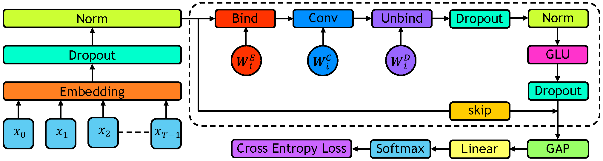

<h2 align="center">HGConv</h2>

### Abstract

<p align="justify">
Malware detection is an interesting and valuable domain to work in because it has significant real-world impact and unique machine-learning challenges. We investigate existing long-range techniques and benchmarks and find that they're not very suitable in this problem area. In this paper, we introduce Holographic Global Convolutional Networks (HGConv) that utilize the properties of Holographic Reduced Representations (HRR) to encode and decode features from sequence elements. Unlike other global convolutional methods, our method does not require any intricate kernel computation or crafted kernel design. HGConv kernels are defined as simple parameters learned through backpropagation. The proposed method has achieved new SOTA results on Microsoft Malware Classification Challenge, Drebin, and EMBER malware benchmarks. With log-linear complexity in sequence length, the empirical results demonstrate substantially faster run-time by HGConv compared to other methods achieving far more efficient scaling even with sequence length ≥ 100,000.
</p>

### Block Diagram

<p align="justify">
The block diagram of the proposed method. The dotted region shows a single layer of the proposed network which is repeated N times. In the figure, <em>prenorm</em> is applied. In the case of <em>postnorm</em>, normalization is applied after the GLU layer before the skip connection.
</p>

<p align="center">

</p>

### Requirements


<p align="justify">
The code is written in <a href=https://github.com/google/jax>jax</a> which is a deep learning framework developed by Google. Jax leverages just-in-time (JIT) compilation and hardware acceleration to optimize the execution of numerical operations. JIT compilation is a technique that compiles code at runtime, just before it is executed which allows the compiler to optimize the code. Moreover, the numerical operations are also optimized using the Accelerated Linear Algebra (XLA) compiler. Along with Jax, Flax and Optax are also used which are higher-level libraries written on top of Jax. 
</p>

```properties
pip install --upgrade https://storage.googleapis.com/jax-releases/cuda11/jaxlib-0.3.15+cuda11.cudnn82-cp39-none-manylinux2014_x86_64.whl
pip install flax==0.6.0
pip install optax==0.1.2
```

Jax is great at optimization and making use of hardware acceleration but it does not have a built-in dataloader for
which we have to rely on Tensorflow and PyTorch data loaders. Install the CPU version of both of them.

```properties
pip install tensorflow-cpu==2.8.0
pip install tensorflow-datasets==4.5.2
pip install torch torchvision torchaudio --extra-index-url https://download.pytorch.org/whl/cpu
```

Finally, install the library that implements the vector symbolic architecture called Holographic Reduced Representations (HRR) which is used in developing HGConv.

```properties
pip install hrr --upgrade
```

### Code Structure

The experiments are performed on 4 different benchmarks.

1. Kaggle: Microsoft Malware Classification Challenge
2. Drebin: Android Malware Classification
3. EMBER Malware Benchmark
4. LRA: Long Range Arena

For each of the benchmarks separate folders are used. In each of the folders, ```dataset.py``` contains the dataloading codes, the main network and all the training codes are available at ```hgconv.py``` file, and the utility and supporting functions are contained in ```utils.py```. 
